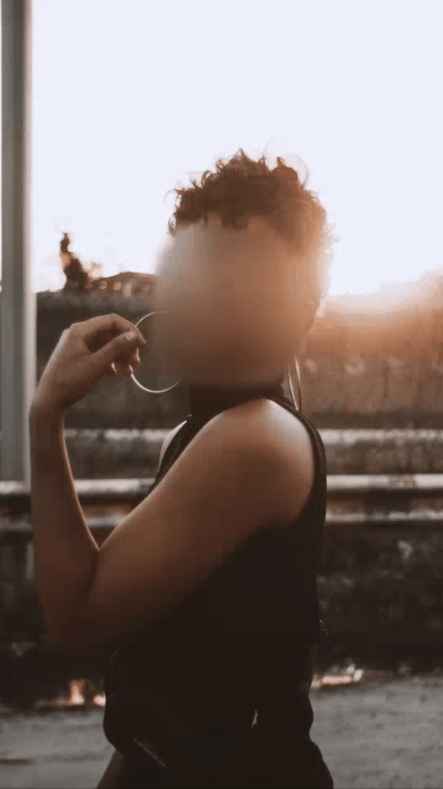
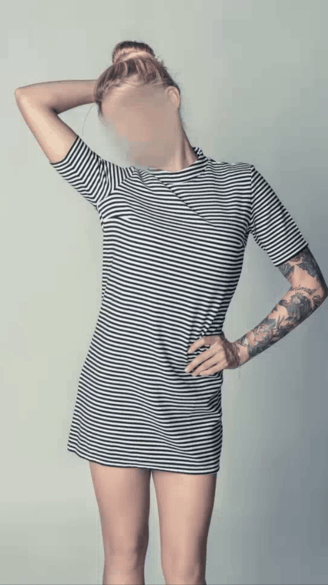

# Structure-Aware Human Body Reshaping with Adaptive Affinity-Graph Network (WACV 2025)
**Qiwen Deng<sup>1</sup>\*, Yangcen Liu<sup>2</sup>\*** (*Equal contribution, order decided by coin toss*)

- **Affiliations**:  
  1. University of Electronic Science and Technology of China  
  2. Georgia Institute of Technology  


**[Paper Link](https://scholar.google.com/citations?view_op=view_citation&hl=en&user=Xq-r3dIAAAAJ&citation_for_view=Xq-r3dIAAAAJ:d1gkVwhDpl0C)**  

## Overview  
---


This repository provides the implementation for **Adaptive Affinity-Graph Network (AAGN)**, a novel approach for automatic human body reshaping. The automatic human body reshaping task focuses on transforming a given portrait into an aesthetically enhanced body shape. AAGN enhances global consistency and aesthetic quality. Adaptive Affinity-Graph (AAG) Block: Captures global affinities between body parts for consistent reshaping. Body Shape Discriminator (BSD): Focuses on high-frequency details for improved aesthetics.

Here are visual results showcasing the transformations achieved by AAGN:  

<table>
  <tr>
    <td></td>
    <td></td>
    <td></td>
    <td></td>
  </tr>
  <tr>
    <td></td>
    <td></td>
    <td></td>
    <td></td>
  </tr>
</table>

## BR5K Dataset
--- 

We utilize the **BR-5K dataset**, the largest dataset for human body reshaping tasks. The dataset preparation process follows the guidelines provided by the [FBBR repository](https://github.com/JianqiangRen/FlowBasedBodyReshaping?tab=readme-ov-file).   


## Get Started
---
### Install Requirements

&#8226; python >= 3.7
&#8226; torch >= 1.2.0

### Prepare the data
After obtaining the BR-5K dataset, move the `` src `` folder and `` gt `` folder inside it to the `` data `` folder of this repository. The directory structure will look like this: 
<pre>
<code>
./data/gt/
  ├── 09084aeda464bfc66.jpg
  ├── 9a3737d2ddbedfbb2.jpg
  └── ...
./data/src/
  ├── 09084aeda464bfc66.jpg
  ├── 9a3737d2ddbedfbb2.jpg
  └── ...
</code>
</pre>
Then download the [detection model](https://download.openmmlab.com/mmpose/v1/projects/rtmpose/rtmdet_m_8xb32-100e_coco-obj365-person-235e8209.pth) and the [pose model](https://download.openmmlab.com/mmpose/v1/projects/rtmposev1/rtmpose-x_simcc-body7_pt-body7_700e-384x288-71d7b7e9_20230629.pth) and put them into the `` mmpose `` folder.

Generate skeleton maps:
<pre>
<code>
python mmpose/generate_skeleton.py
</code>
</pre>
Run the optical flow estimation script: (this step requires the `` cupy `` package, but directly installing it via pip may encounter some issues. We recommend downloading its [wheel file](https://files.pythonhosted.org/packages/fe/19/b5fc30ab79014d7f7e4403735717111f8e69468b8a8804a882b717bedc88/cupy_cuda110-7.8.0-cp37-cp37m-manylinux1_x86_64.whl) for installation instead)
<pre>
<code>
python pwcnet/create_data.py
</code>
</pre>

### Training
<pre>
<code>
python train.py
</code>
</pre>

### Evaluation
To evaluate:
<pre>
<code>
python evaluate.py --
</code>
</pre>

| Method       | SSIM ↑   | PSNR ↑   | LPIPS ↓   |
|--------------|----------|----------|-----------|
| GFLA         | 0.6649   | 21.4796  | 0.6136    |
| pix2pixHD    | 0.7271   | 21.8381  | 0.2800    |
| FAL          | 0.8261   | 24.1841  | 0.0837    |
| ATW          | 0.8316   | 24.6332  | 0.0805    |
| FBBR         | 0.8354   | 24.7924  | 0.0777    |
| **Ours**     | **0.8427** | **26.4100** | **0.0643** |


## Citation  
---

If you find our work helpful in your research, please consider citing us:  

```bibtex
@misc{deng2024structureawarehumanbodyreshaping,
      title={Structure-Aware Human Body Reshaping with Adaptive Affinity-Graph Network}, 
      author={Qiwen Deng and Yangcen Liu and Wen Li and Guoqing Wang},
      year={2024},
      eprint={2404.13983},
      archivePrefix={arXiv},
      primaryClass={cs.CV},
      url={https://arxiv.org/abs/2404.13983} 
}
```

## Acknowledgement  
---  
We express our gratitude to [FBBR](https://github.com/JianqiangRen/FlowBasedBodyReshaping?tab=readme-ov-file) as we benefited greatly from their paper and code.  
